# Minecraft: Vibed Edition

This is a hobby project, or rather an experiment, where I attempt to recreate
Minecraft, as many have before, but in Rust, and using 99% AI. The textures
are drawn by me and some of the debugging is done by me, as well as all the
AI prompts to implement features and most bug fixes, but everything else is 
vibe coded. The AI mostly used for this project is Claude. The game is being
tested on a Fedora Linux 43 laptop with an Intel GPU and 16 GB of RAM. In
production, as of the end of day 1, the game runs at full FPS (not measured, but
it visually looks high FPS) while using only around 74 MB of RAM.

## Progress Reports:

### First Successfully Compiled Version  
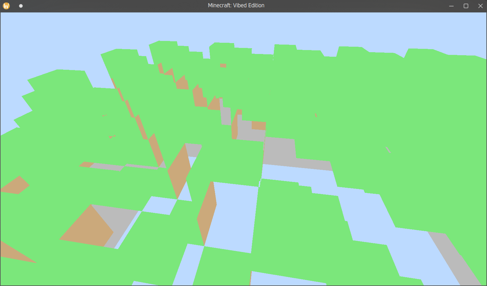
Version 0: The first version successfully compiled and comitted to GitHub. This
version features a 16x16 block chunk of a checkerboard-like pattern of blocks.
It includes layers of grass, dirt, and stone, all solid colors with no directional
shading, and some rendering bugs. Movement is based on Minecraft's spectator mode,
with standard WASD Space and Shift movement to fly around, and right click & hold
to move the camera. The mouse is not locked in place when moving the camera, but
it is locked to the window, so you can only move the camera so far in one go before
your mouse hits the edge of the window.  
Here's a video showcasing this version:  
[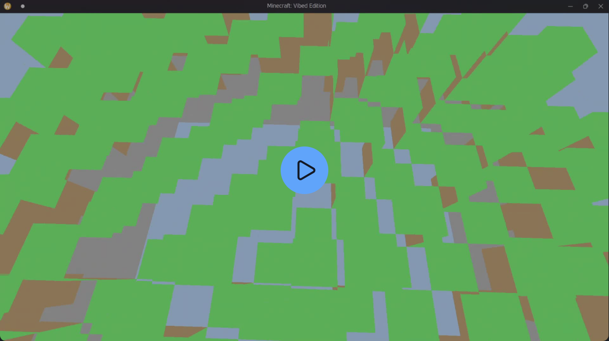](https://stellicast.com/watch/vuhkEM6L)

---

### Rendering Improvements
2 Commits later, the rendering bug was fixed and directional shading was added. 
I also attempted to fix camera movement so the mouse stayed locked in the center
while the camera was moving, but I failed to make it any better in 4 or 5 AI
prompts, so I put it off for a later date.  
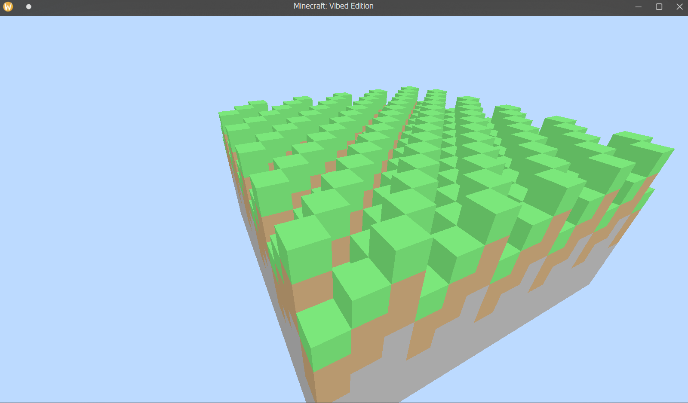

---

### 8x8 Block Textures
I then made 8x8 pixel art textures (tried to AI generate them, but I couldn't get
any AI to make true pixel art, and when I could, it was always too many pixels and
was the wrong block face).  
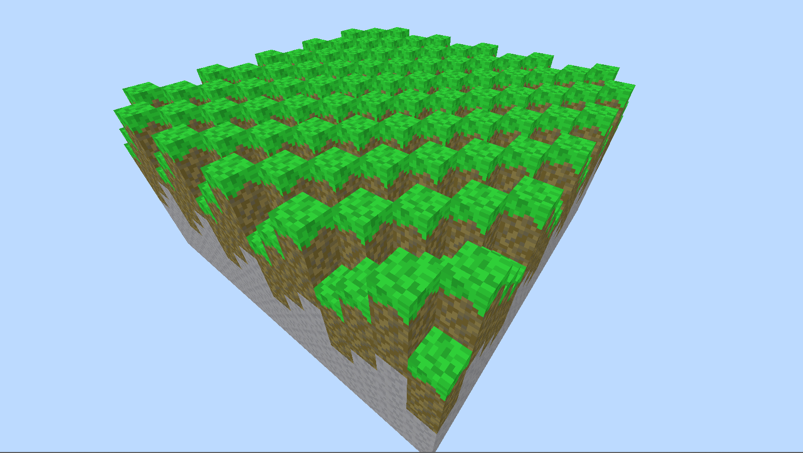

---

Let's stop showcasing every individual change. We'll do 1-2 updates per day of
development from now on.

### Remaining Day 1 Progress

By the end of day 1, I had also implemented terrain generation (including caves)
and multiple chunks. I made the world size 16x16 chunks, each 16x16x128 (LxWxH)
blocks. I also added different biomes. I'm not sure if all of these are implemented,
but I asked Claude for:
- Plains
- Hills
- Mountains
- Valleys  
And maybe one other, I can't remember. There also appears to be random dirt
sploshes here and there that resemble craters. 

An interesting bug I had when implementing biomes caused these sharp edges
between biomes, creating an interesting visual effect and revealing the pattern
of the biome shapes and placement.  
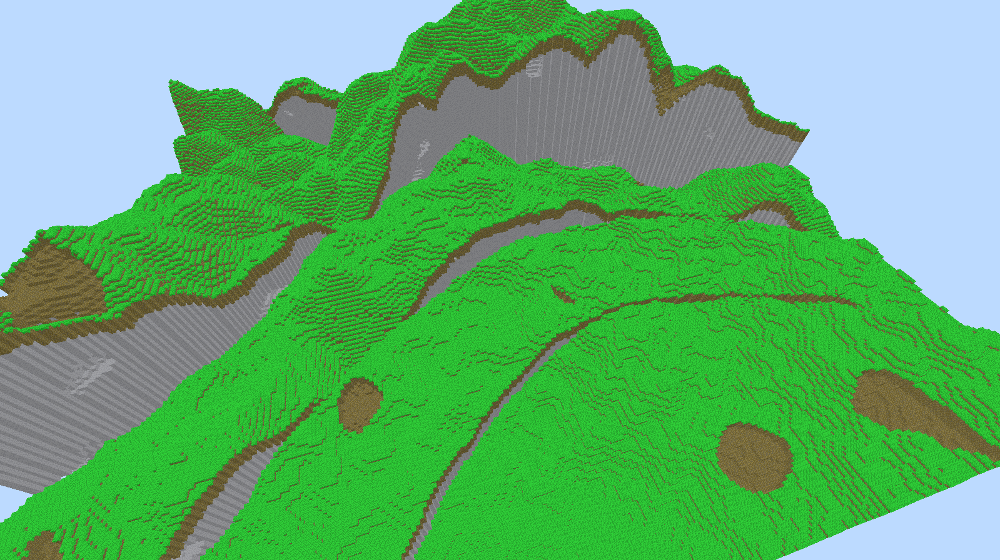

I fixed this by blending biomes on their borders. This surprisingly only took
one AI prompt to fix.  
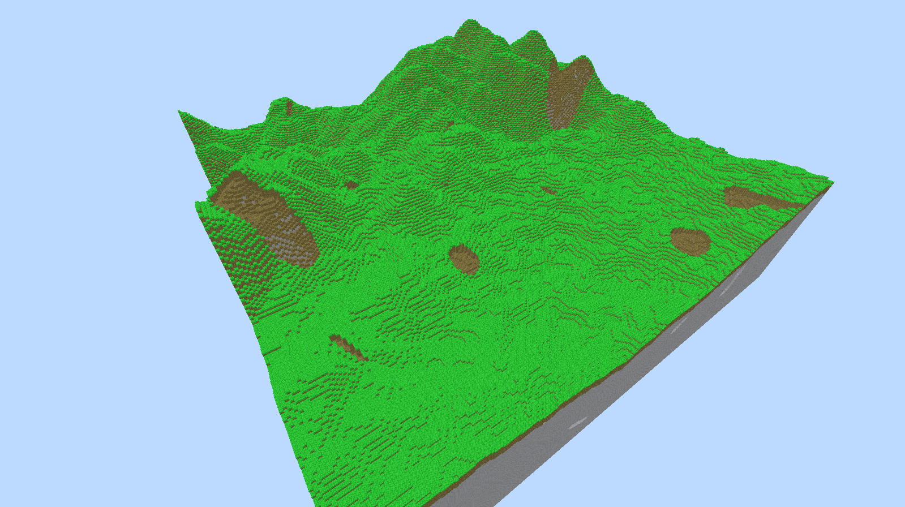

---

### Day 2
Day 2 had much less noticeable progress than day 2, but I actually made so much
progress that I used up all my free Claude credits for the day on 5 or 6 different
Claude accounts. Most of it was troubleshooting. I did not have as much luck on
day 2 with getting things right first or second try as I did on day 1.

On day 2, I implemented a main menu and a loading screen. This makes the game 
launch almost instantly rather than waiting to render anything until the world
has loaded. It also lets you pick a world size from 5 presets, though the last
2 presets are too large and crash the game. 

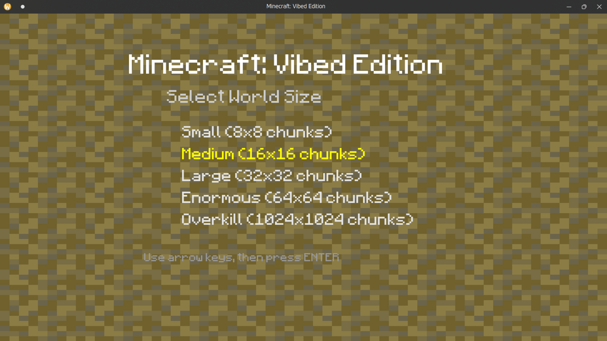  
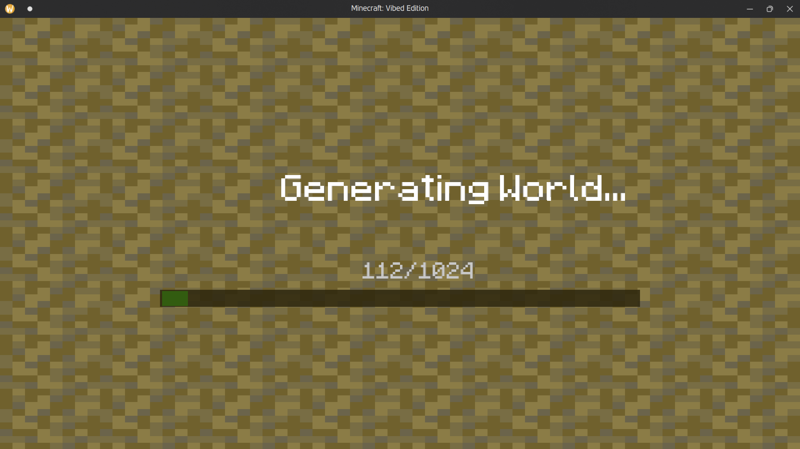

I've also noticed that world generation is several orders of magnitude faster 
in a release executable compared to development. I knew it would be faster, but 
had no idea that a roughly 5-minute task in development would take more like 
15 seconds in production.

I also added trees to world generation.  
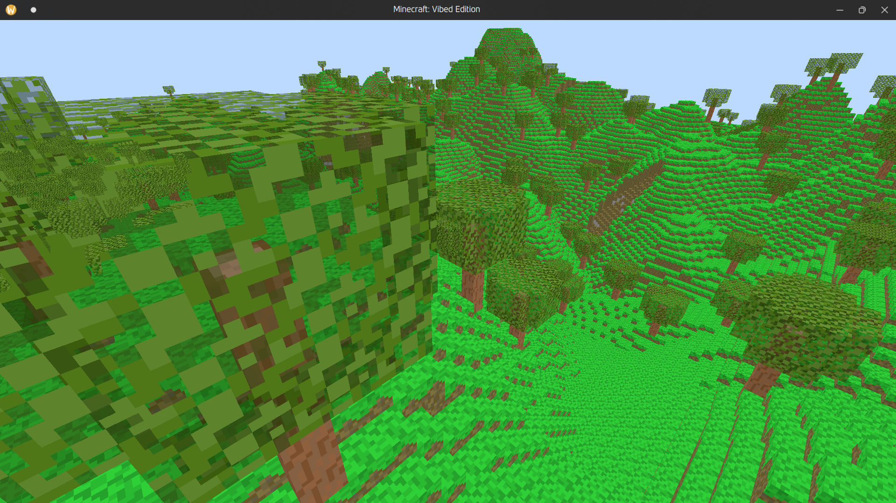  

Here's a demo video for the progress so far:  
[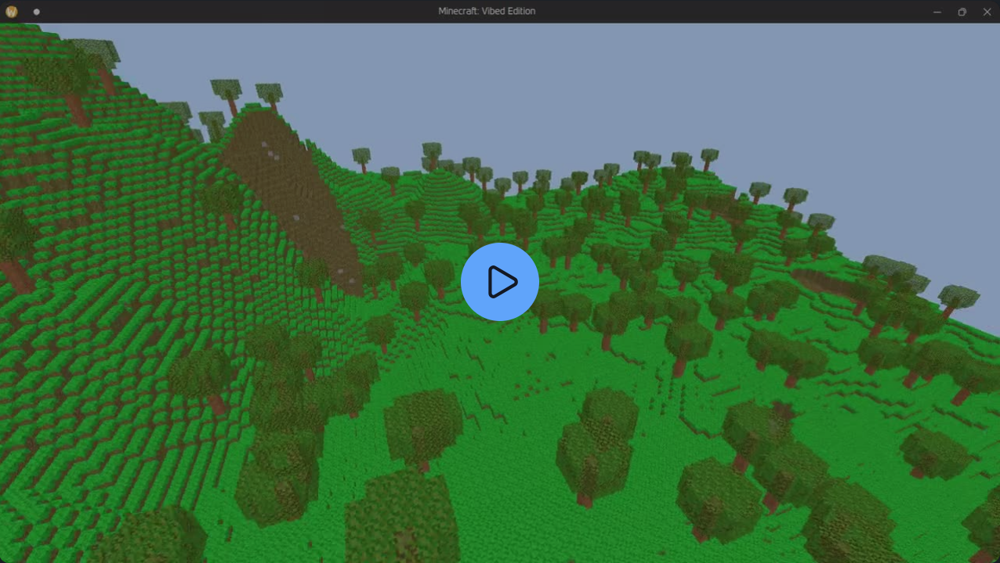](https://stellicast.com/watch/yx33lQ9U)

---

### Day 3
Day 3 was rather productive. Although the number of features pales in comparison
to day 1, I feel like it was my most productive day yet. Mainly because the 
features I added and updated are very nice.  
First, I updated the main menu:  

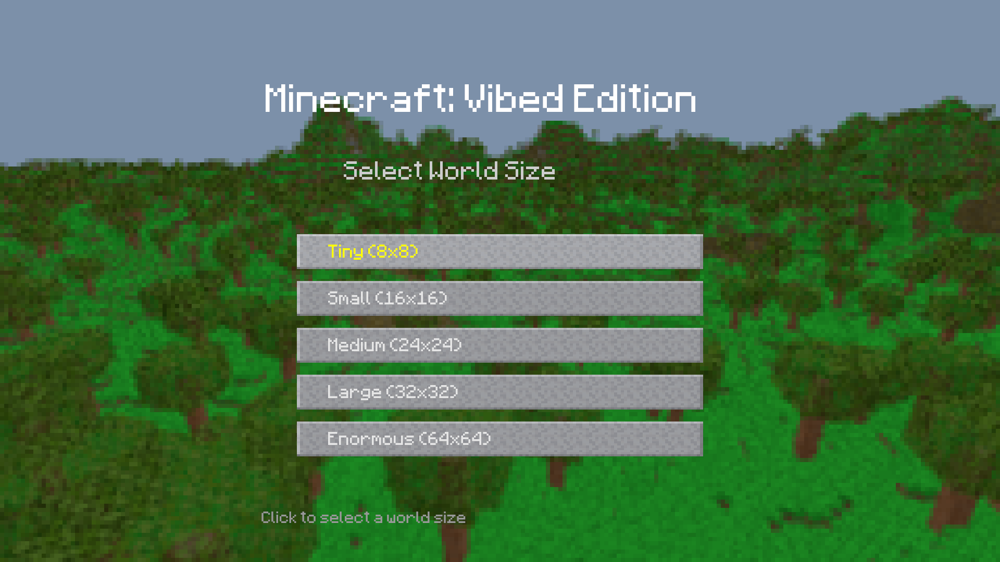

Second, I added **Creative Mode**! Below is a demo video for creative mode:
[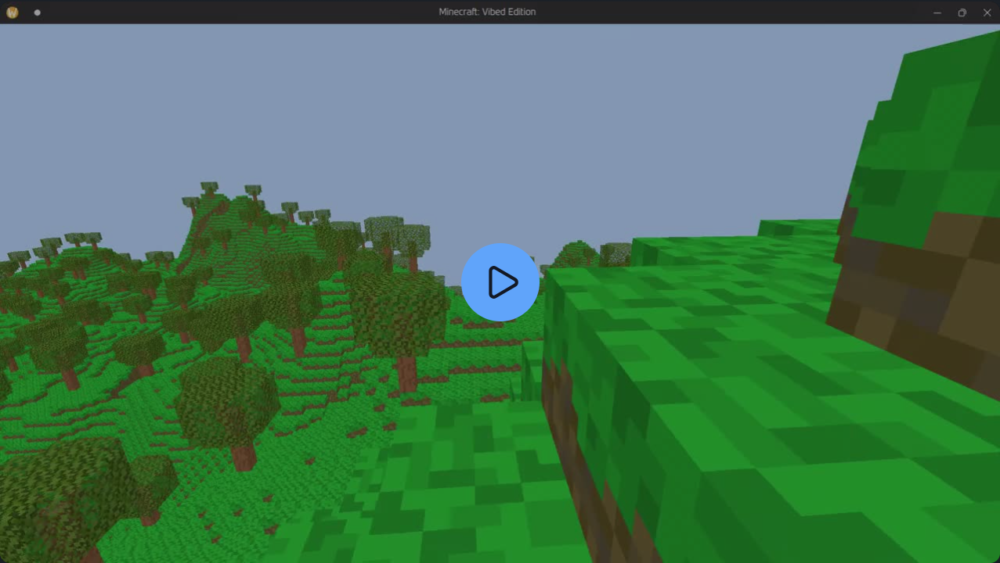](https://stellicast.com/watch/TplacIZr)  
This video was recorded before you could choose which block to place.

Creative mode is very basic so far. There's gravity, block collisions, jumping,
block breaking, and block placing. You can press F (or G for some reason)
to switch between Creative and Spectator modes. There's 9 different blocks
to choose from to place, as seen in the new hotbar.

I also updated the world sizes to be a little more reasonable, as seen in the 
first image for Day 3.

I also fixed camera movement so you can freely move your mouse as far as you want
now. On top of this, I also fixed the bug where large world sizes crash the game
because they overflowed the buffer, as Claude said. I fixed it by giving each
chunk its own buffer in memory. However, there's now a bug in 64x64 where you 
usually can't jump. Going down a block sometimes helps you be able to jump. 
Not sure why this happens, I just know it's connected to exessive world size.

---

### Day 4
Day 4 was even more productive than day 3. Here's a summary of the changes made:
- Crosshair texture was fixed and given an invert colors affect just like in real Minecraft
- Hotbar slot textures were fixed.
- A pause menu was added with 3 options:
  - Resume Game
  - Exit to Main Menu
  - Exit to Desktop
- Added **World Save Files**
  - This took up most of the day to implement
- Added a world creation screen on the main menu
- Added a load from save screen on the main menu
- Updated main menu to show 3 buttons:
  - Load World
  - Create New World
  - Quit

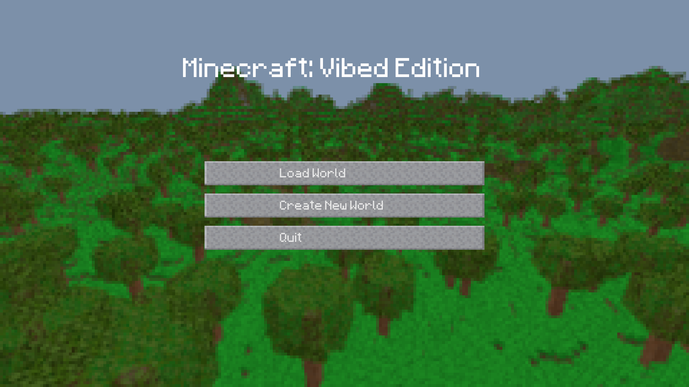  
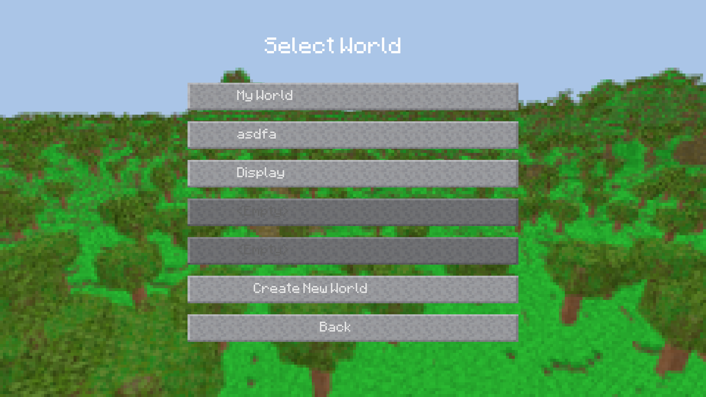  
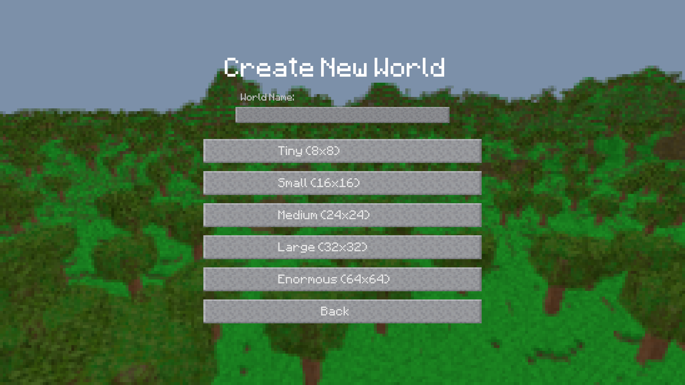

---

### Day 5
Day 5 has just started as of the writing of this, but if I work on the project,
I plan to implement the following features:
- Fix rendering glitch on loaded existing worlds
- Add creative inventory
- Toggle fly by double pressing space bar without entering spectator mode
- Fix surface caves
- Time permitting: add water
- Time permitting: add peaceful mobs
